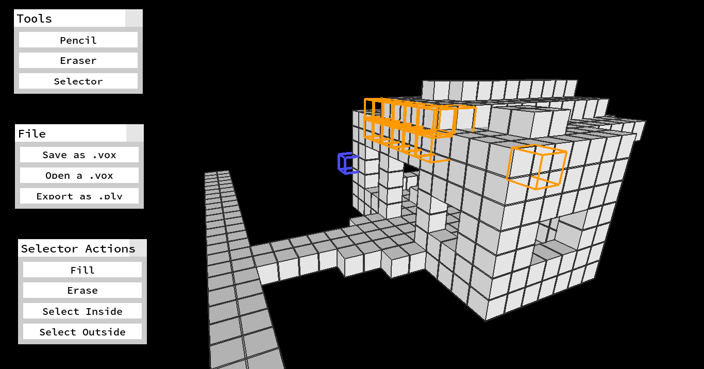

MoxelEd
-------

MoxelEd is a voxel model editor. The idea is to construct 3d models out of cubes, instead of fancy 3d triangle editors, such as Blender or Maya3d (pfft, who needs precision).

This project is meant for the artistically incapable... like me!

